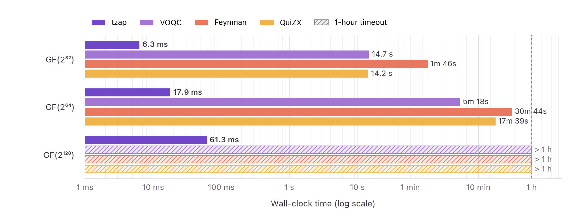

# ⚡️ tzap

[](https://github.com/qqq-wisc/tzap/actions/workflows/ci.yml)


[](https://arxiv.org/abs/2605.13929)

A super fast, Rust-based optimizer for large Clifford+T circuits.
- tzap's **philosophy** is that each optimization pass should be **linear** in circuit size.
- tzap **minimizes T-count** with a new linear-time phase folding algorithm, based on [this paper](https://arxiv.org/abs/2605.13929).
- tzap implements a new and fast **superoptimization** pass.
- The core optimization algorithms are **fully formalized in Lean** under [`formalization`](formalization/).

tzap is **multiple orders of mangitude** faster than other optimizers&mdash;and **linearly** **scales** to **millions** of gates!


## Installation

**Prebuilt binary** (no Rust required) — macOS/Linux:

```bash
curl --proto '=https' --tlsv1.2 -LsSf https://github.com/qqq-wisc/tzap/releases/latest/download/tzap-opt-installer.sh | sh
```

**Homebrew** (macOS/Linux):

```bash
brew install qqq-wisc/tap/tzap
```

**From crates.io** (requires [Rust](https://rustup.rs/)):

```bash
cargo install tzap-opt
```

**From source**, clone this repository and run:

```bash
cargo install --path .
```

## CLI Usage

tzap is a CLI optimization tool for quantum circuits. You can also use tzap as a Rust library; see the [Rust API documentation](API.md).

**Optimize a circuit and inspect the results**

The most common usage of tzap is `tzap input.qasm -o output.qasm`, where the `input.qasm` circuit is optimized into `output.qasm`. For example, using the benchmarks in this repo:

```bash
tzap benchmarks/feynman/gf2^256_mult.qasm -o optimized.qasm
```

tzap output:

```text
⚡️ tzap
  Parsing benchmarks/feynman/gf2^256_mult.qasm (13.9 MB)
	└─ 768 qubits · 1,115,899 gates · 458,752 T/Tdg · 0.207s

  Final result
	├─ Gates  1,115,899 → 657,723 (↓41.1%)
	├─ T/Tdg  458,752 → 262,400 (↓42.8%)
	└─ Time   0.320s
```

**Optimization levels**

| Level | Description |
|---|---|
| `-O1` | Runs randomized phase folding and basic gate cancellation. This is the default. |
| `-O2` | Adds superoptimization to the `-O1` pipeline. |
| `-O3` | Repeats the `-O2` pipeline until reaching a fixpoint. |
| `-Osuper` | Like `-O3`, but with a larger superoptimization power. |

For example, to run the most powerful optimization pipeline:

```bash
tzap -O3 benchmarks/feynman/gf2^256_mult.qasm -o optimized.qasm
```

For an even more thorough (but slower on first use) pass, try `-Osuper`:

```bash
tzap -Osuper benchmarks/feynman/gf2^256_mult.qasm -o optimized.qasm
```

**Decompose Rz gates into Clifford+T and choose the precision**

Use `--decompose-rz` when the target backend accepts only Clifford+T gates. tzap decomposes `Rz` gates with [gridsynth](https://crates.io/crates/rsgridsynth). Use `--epsilon` to trade approximation accuracy for a potentially smaller circuit; a larger epsilon permits a coarser approximation. If you omit `--epsilon`, tzap uses `1e-10`.

```bash
tzap input.qasm -o output.qasm --decompose-rz --epsilon 1e-6  # omit --epsilon to use 1e-10
```

**Run a custom optimization pipeline**

tzap allows you to run a custom sequence of optimization passes with `--passes`. Use it when you need explicit control over which passes run and their order. The listed passes replace the default pipeline.

```bash
tzap input.qasm -o output.qasm --passes CancelGates,PhaseFoldRand
```

## Circuit support

tzap supports a subset of OpenQASM 2.0:

- **Supported gates:** `h`, `x`, `z`, `s`, `sdg`, `t`, `tdg`, `rz`, `cx`, `ccx`, `ccz`, `cz`, `measure`, `reset`
- **Supported declarations:** `qreg`, `creg`
- **Not supported:** classical conditionals (`if`), custom gate definitions (`gate`), barriers, and `include` files (besides `qelib1.inc`, which is ignored)
- Unrecognized lines will produce an error

**Gate handling**: Toffoli (`ccx`) and doubly controlled-Z (`ccz`) gates are represented natively and automatically decomposed into Clifford+T before optimization. Controlled-Z (`cz`) gates remain native so phase folding and cancellation can operate through them; use `--passes DecomposeCz` when a backend requires `H`+`CX` output. `Rz` gates are left as-is unless you pass `--decompose-rz`.

## Correctness

We validate the correctness of tzap's optimizations using two complementary methods:

1. **Fuzzing and equivalence verification:** We test small, randomly generated circuits and benchmark circuits, checking that optimization preserves circuit equivalence.
2. **Lean formalization:** We implement the core optimization algorithms in Lean 4 and prove their soundness. See the [`formalization`](formalization/) directory for the proofs and their correspondence to the paper.

## Citation

If you use tzap in your research, please cite:

```bibtex
@misc{albarghouthi2026tzap,
      title={Linear-Time T-Gate Optimization via Random Abstraction}, 
      author={Aws Albarghouthi},
      year={2026},
      eprint={2605.13929},
      archivePrefix={arXiv},
      primaryClass={cs.PL},
      url={https://arxiv.org/abs/2605.13929}, 
}
```
